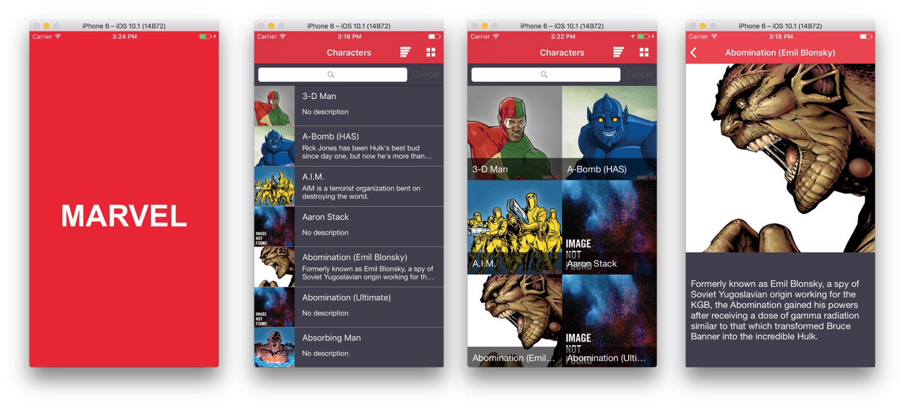

# Marvel App


<p align = "center">
    <a href="#appearance"> Aparência </a>;
    <a href="#posts"> Postagens </a>;
    <a href="#installation"> Instalação </a>
</p>
-------

##  Aparência

<h3 align = "center">
  
</h3>


## Posts

## Installation

This project uses [Bundler](http://bundler.io) and [CocoaPods](https://cocoapods.org). All you need to setup it properly is:
```
bundle
bundle exec pod install
```

## Tests And Coverage

You can run the tests any time. All your need to do is:
```
bundle exec fastlane test
```

## License
This project is licensed under the terms of the MIT license. See the LICENSE file.
